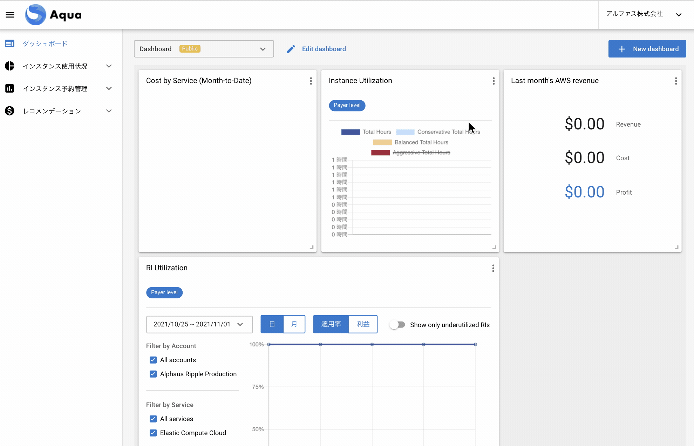

# ダッシュボード

WavePROからAquaに遷移するとダッシュボードが表示されます。

ダッシュボードはユーザーごとに見たい情報のウィジェットを選択しカスタマイズすることが可能です。

## 新規ダッシュボードの作成

1. 画面右上の「+New Dashboard」ボタンをクリックする。
2. ダッシュボード名を入力し、PrivateかPublicの選択をする。  
Private: 自分にのみ表示されるダッシュボード  
Public: 他のサブユーザーも閲覧することができるダッシュボード
3. 表示したいウィジェットが決まっている場合は1つ選択し「閉じる」を押し作成が完了。

## ダッシュボードの編集

1. ドロップダウンから編集したいダッシュボードを選択する。
2. 隣の「Edit Dashboard」をクリックする。  
設定: ダッシュボード名やPrivate・Publicの変更  
ウィジェット: ウィジェットの追加  
Delete Dashboard : ダッシュボード自体の削除可能。  

## ウィジジェットの種類

| ウィジェット名 | 説明 | 関連ページ |
|----------------|------|------------|
| RI/SP Recommendation Widget | RI/SPReservedInstance、SavingsPlansを購入した場合の削減額などのサマリー | レコメンデーション＞ RI/SPインスタンス |
| Instance Utilization Widget | インスタンスごとの利用状況のサマリー | レコメンデーション＞スケジューリング |
|  RI Utilization Widget | RI適用状況のグラフ | インスタンス予約管理 ＞ RI管理 |
| Coverage Usage Widget | 稼働しているインスタンスに対する内容のグラフ | インスタンス使用状況＞適用率 |
| Right Sizings Widget | サイズ最適化を実施した場合の削減額などのサマリー | レコメンデーション＞ライトサイジング |
| Profit Breakdown | AWSの原価・売り上げ・利益などのサマリー | - |
| Cost by Service | サービスごとのコスト | - |

---
