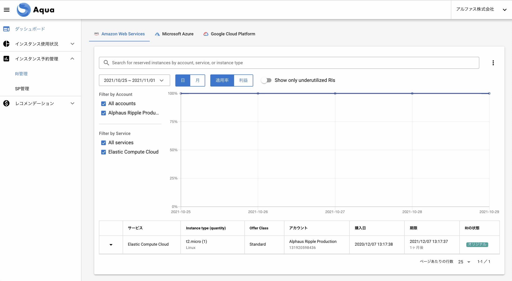
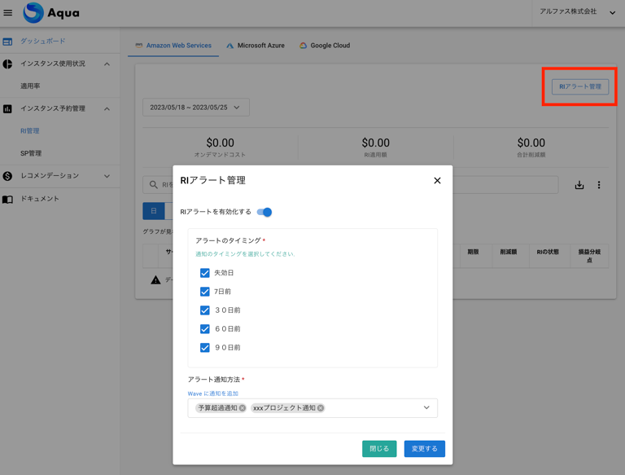

# インスタンス予約管理

Aqua のメニューにある「インスタンス予約管理」の内容について記載しています。

## RI管理

管理しているアカウントが保有しているReserved Instances の一覧と適用状況を表示しています。

### RIの一覧と適用状況を確認する

1. 閲覧する期間や内容を変更します。  
・カレンダーから閲覧する期間を指定。  
・日別・月別を指定。  
・適用率・利益（削減額）を指定。  
・必要な場合のみ Show only underutilized RIs を有効化: 有効化すると100%の適用率でないRIのみを表示します。

2. 1で設定した範囲でのRIの一覧が表示されます。  
1) グラフ  
所有している各RIが適用されている割合（％）や利益が表示されます。  
2) 一覧  
保有しているRIが種類ごとに１行づつ表示されます。

### 各項目

| 項目名                               | 説明                                                     |
|--------------------------------------|----------------------------------------------------------|
| サービス                             | RIを購入したサービス (例: RDS, ElastiCache, ES など） |
| Instance type (quantity)             | インスタンスタイプ （個数）                              |
| アカウント                           | 購入アカウント                                           |
| 購入日                               | 購入した日時（UTCベース）                                |
| 期限                                 | UTCベースの期限                                          |
| RIの状態                             | RIの移動機能を使用した場合のみに必要な項目               |
| ARN                                  | RIのARN                                                  |
| 支払いアカウント | 購入アカウントの属性 |
| スコープ | Region か AZ |
| ゾーン | Availability zone |
| 支払いオプション | タイプ（Standard か Convertible） 期間（1年か 3年） 支払いタイプ（全額前払い、一部前払い、前払いなし）を表示 |
| 前払い金額 | 購入時に支払った金額 全額前払い、一部前払いの支払いタイプのみ金額が発生 |

## SP管理

管理しているアカウントが保有しているSavingsPlasn の一覧を表示しています。

| 項目名 | 説明 |
|--------|------|
| タイプ | SPの種類: EC2 Instance, Compute, AWS SageMaker |
| サービス | EC2、RDSなどSPの適用対象サービス |
| インスタンスファミリー | EC2 Instance SPs の場合は購入したインスタンスファミリーを表示 |
| コミットメント | 時間あたりのコミット金額 |
| リージョン | 対象のリージョン |
| アカウント名 | SPを購入したアカウント名 |
| アカウントID | SP を購入したアカウントID |
| 購入日 | 該当の SP を購入した日時（UTCベース） |
| 期限 | 該当の SP の期限（UTCベース） |
| 支払いオプション | 全額前払い・一部前払い・前払いなし |
| 期間 | 1年もしくは3年 |

## RI・SPアラート管理

各右上の「RIアラート管理」「SPアラート管理」ボタンからRIやSPの有効期限が切れる前に設定した通知先にアラートを飛ばすことができます。

単位: 失効日当日、7日前、３０日前、６０日前

通知先: メール、Slack、MS teams

新規のアラート通知先を追加する場合は「Waveに通知を追加」をクリックし通知設定ページで設定する必要があります。

## 通知の設定方法

1) Wave Pro左メニューから「環境設定」をクリック

2) 「通知設定」から「＋チャネル追加」をクリックします。

3) 各必須項目を入力し右下の「保存する」をクリックします。

4) 保存された通知は通知チャネルの一覧に表示がされます。

5) ここで表示された通知はAquaでの設定から選択できるようになります。

## Aquaの操作方法

1) Aquaの左メニューから「RI管理」「SP管理」をクリックします

2) 各画面の右上の「アラート管理」からRipple, Wave Proで設定した通知チャネルが表示されます。

3) 表示された通知チャネルの中から利用したい通知を選択します。

4) 変更するボタンを押し設定完了です。

---
