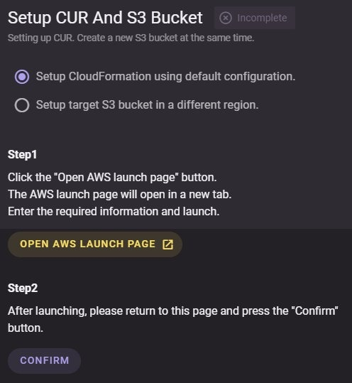
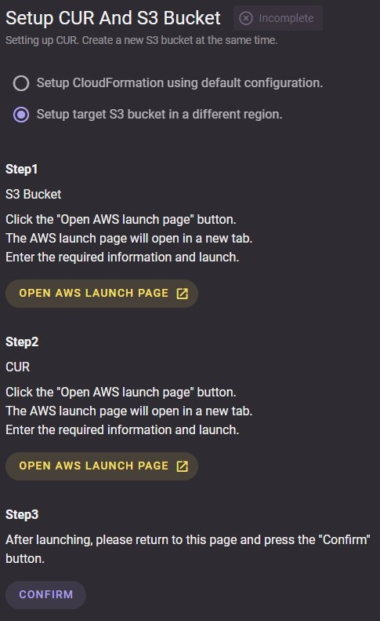

# CUR and S3 Bucket Setup for Payer Accounts

To pull your AWS data to Octo, there is a need to setup the CUR and S3 bucket for payer accounts.

There are 2 ways to setup the CUR and S3 bucket in Octo.

#### During new account registration 

- Provider Account -> Account Registration -> Register New Account -> Setup CUR and S3 Bucket (After Get API Access)

#### During update of account settings.

- Provider Account -> Account Registration -> Select account from the list -> Action Dropdown button -> Setup CUR and S3 Bucket

## Two deployment ways when setting up the CUR and S3 bucket:

### Setup CloudFormation using default configuration.
The CUR export settings and the target S3 bucket will be deployed to us-east-1 region.

1. Select [Setup CloudFormation using default configuration].

2. Click [Open AWS Launch Page].

3. Clicking the link above will take you to your CloudFormation console.

4. Please make sure that it is deployed on the default `us-east-1` region.

5. Once done, come back to this page and click [Confirm] to start the verification process.

 
### Setup target S3 bucket in a different region.
S3 bucket is setup on a desired region aside from us-east-1 region.

1. Select [Setup target S3 bucket in a different region].

2. Under S3 Bucket, click [Open AWS Launch Page].

3. Clicking the link above will take you to your CloudFormation console.

4. Under CUR, click [Open AWS Launch Page].

5. Clicking the link above will take you to your CloudFormation console.

6. Set the `CurS3BucketOption` parameter to `USE_EXISTING`, then set your `CurS3BucketName` and `CurS3BucketRegion` accordingly.

7. Please make sure that it is deployed on the `us-east-1` region.

8. Once done, come back to this page and click [Confirm] to start the verification process.