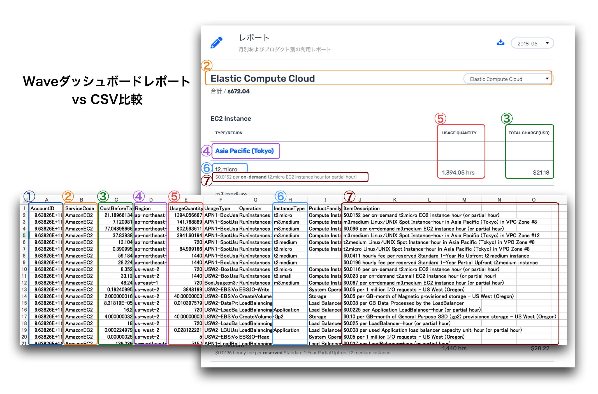

# レポートとCSVの比較

このページではダッシュボードのレポートとダウンロードしたCSVを照らし合わせ、各項目について説明しています。

レポートとCSVで同義で違う単語や略称で表示されている項目があります。

下の図で同じ色で囲われている部分が同様の項目となります。

1. AccountID: この明細項目を使用したAWSアカウントの IDです。
    * レポートはアカウント単位での表示・ダウンロードなので1つのCSVにつき1つのIDのみ表示されます。
2. ServiceCode: 明細項目の対象になる製品の製品コードです。
    * Elastic Compute Cloudなど、尚、CSVでは `Elastic Compute Cloud` は `AmazonEC2` 、`Simple Storage Service` は `AmazonS3`などの製品コードで表示されます。
3. CostBeforeTax: 税抜きの非ブレンド月次利用額です。
    * レポートは小数点以下第2位まで表示されます。この例ではレポート上は `$21.18` CSVでは `21.18966134` で一致しています。
4. Region: サービスを利用したリージョンです。
    * この例ではダッシュボードは `Asia Pacific(Tokyo)` と表示されており、CSVだと`ap-northeast-1` となります。どちらとも東京リージョンを指しています。
5. UsageQuantity: 指定した期間に発生した使用量です。
    * この例ではレポート上は `1,394.05` CSVでは `1,394.056667` で一致しています。
6. InstanceType: インスタンスの種類です。
    * この例ではレポート、CSVともに `t2.micro` で一致しています。
7. ItemDescription: 明細項目タイプの説明です。例として、使用料の明細項目は、特定の期間に発生した使用タイプを要約したものです。
    * この例ではレポート、CSVともに `$0.0152 per on-demand t2.micro EC2 instance hour (or partial hour)` で一致しています。

その他に、CSVにのみ記載されている項目についての説明です。

* UsageType: この明細項目の使用状況の詳細です。
    * 例: `APN1-BoxUsage:m2.2xlarge` は、アジアパシフィック 東京リージョン の M2 ハイメモリダブルエクストララージインスタンスについて説明します。
* Operation: この明細項目の対象となる特定の AWS オペレーションです。
    * 例: `RunInstances` の値は Amazon EC2 インスタンスのオペレーションを示します。
* ProductFamily
    * 製品タイプのカテゴリです。
