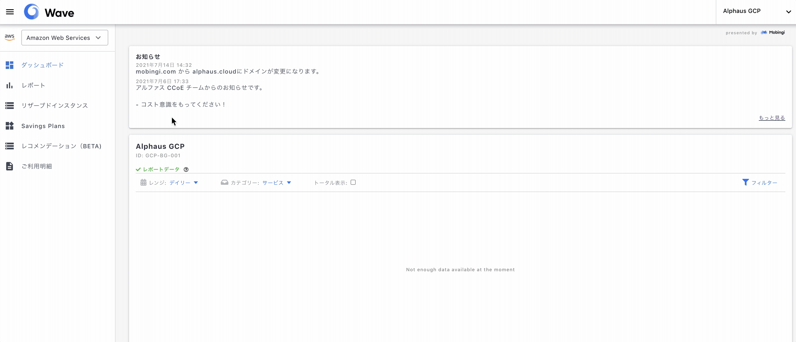

# Wave for GCP 概要

Waveを利用することで日次、月次のコストデータをほぼリアルタイムで確認できます。 ログイン後左上のドロップダウンから Google Cloud Platform を選択するとデータが表示されます。

[Wave ログインURL](https://app.alphaus.cloud/wave/login)

## 日次、月次グラフ

日次コストは過去31日分がグラフで表示されます。サービスのフィルタリングや日次、月次データの切り替えなどを行うことで日々のコスト状況を確認することができます。

**仕様上の注意点**

グラフは従量課金の費用のみとなり、Marketplaceでの購入や返金情報などは載っていません。
