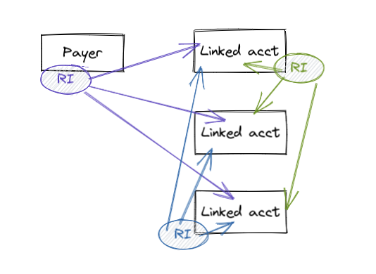
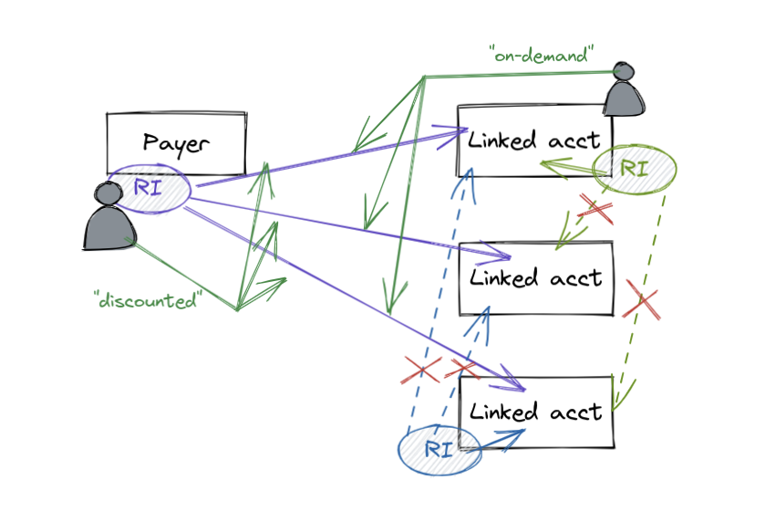
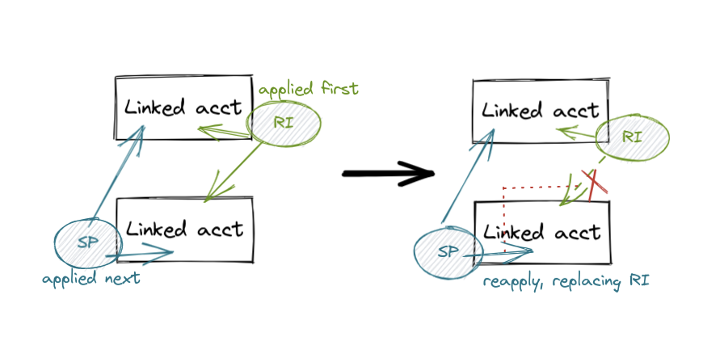

# About our TrueUnblended calculations for AWS

!!! note
    TrueUnblended only applies to your [AWS](https://aws.amazon.com/) cost calculations.

In [AWS consolidated billing](https://docs.aws.amazon.com/awsaccountbilling/latest/aboutv2/consolidated-billing.html), unless configured otherwise, all the usages of all member accounts of an organization, including the payer, are combined in order to share volume discounts, and RI/SP discounts. This is beneficial from a cloud reseller and an enterprise CCOE's point of view as they can share RI/SP discounts purchased at the payer level across the organization.

<figure markdown>
  
</figure>

However, from a client's perspective, there are cases, depending on how the [billing group](https://alphauslabs.github.io/docs/concepts/#billing-group) is configured, where knowing the real costs is required. Real costs here simply means the true costs accrued by a member account or a [billing group](https://alphauslabs.github.io/docs/concepts/#billing-group) with only its own RI/SP discounts applied. Therefore, external discounts, such as payer-level discounts, and discounts from other member accounts, need to be reverted and recalculated. This is one of the corrective recalculations covered by TrueUnblended.

<figure markdown>
  
</figure>

Another area where TrueUnblended does corrective recalculations is with [zonal RIs](https://docs.aws.amazon.com/AWSEC2/latest/UserGuide/reserved-instances-scope.html). Zonal RI discounts are applied first before regional RI discounts. As a member account, you might have usages that were already covered by external zonal RI discounts (i.e. from another member account) before your regional RI discounts were being applied. Instead of these usages showing up in your bill as usages using the ondemand rates, TrueUnblended will make sure that your regional RI discounts are applied to these usages as well using [AWS RI application rules](https://docs.aws.amazon.com/AWSEC2/latest/UserGuide/apply_ri.html).

<figure markdown>
  
</figure>

Another area where TrueUnblended does corrective recalculations is with [SavingsPlans](https://aws.amazon.com/savingsplans/)[^1]. RI discounts are applied first before SP discounts. As a member account, you might have usages that were already covered by external RI discounts (i.e. from another member account) before your SP discounts were being applied. Instead of these usages showing up in your bill as usages using the ondemand rates, TrueUnblended will make sure that your SP discounts are applied to these usages as well using [AWS SP application rules](https://docs.aws.amazon.com/savingsplans/latest/userguide/sp-applying.html).

<figure markdown>
  
</figure>

[^1]: Support is expected to be released by Q2, 2022.
