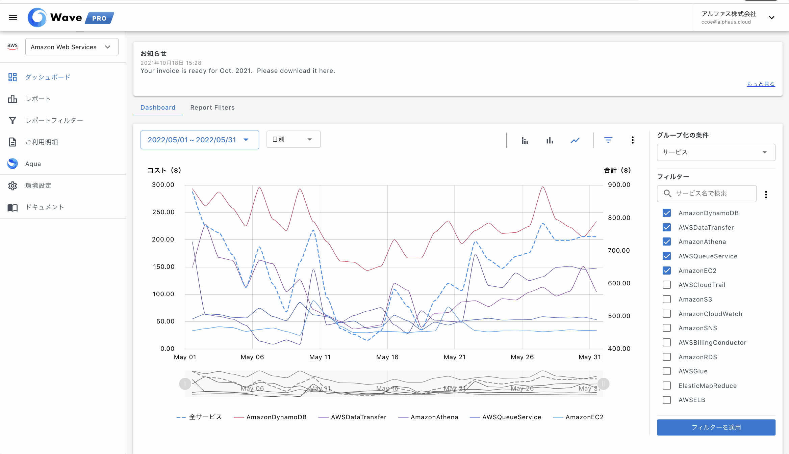

# API アクセストークンの発行

Wave APIを利用することでWave PRO上で表示されている各数値データの取得が可能になります。

## Wave PRO UI設定手順

1. Wave PRO左メニューから「環境設定」 > 「APIアクセストークン」をクリック
2. 右上の「新しいトークンの作成」をクリック
3.  任意でトークン名を登録しトークンの発行に利用するClient IDとSecretを発行します



## アクセストークンのエンドポイント

以下は、製品固有のアクセス トークンを取得するために使用されるエンドポイントです。

これらのトークンを、API への呼び出しで Authorization: Bearer {token} HTTP ヘッダーを使用して使用します。

Wave(Pro) アクセス トークンは Wave(Pro) エンドポイントでのみ有効です。

```
https://login.alphaus.cloud/access_token
```

アクセス トークンを取得するには、以下に説明する形式でアクセス トークン エンドポイントに POST メッセージを送信してください。

**Request**

```
POST {access-token-url} HTTP1.1Content-Type: multipart/form-data{body formdata}
```

| **Name**        | **Value**                                                                                        |
| --------------- | ------------------------------------------------------------------------------------------------ |
| `grant_type`    | 有効な value(s): `password`, `client_credentials`                                                   |
| `client_id`     | Wave PROのUIから発行し取得した client id                                                                   |
| `client_secret` | Wave PROのUIから発行し取得した secret                                                                      |
| `username`      | grant\_typeがpasswordのときはusernameとpasswordが必須になります。 usernameとpasswordはログイン時に入力するユーザー名とパスワードのことです。 |
| `password`      | grant\_typeがpasswordのときはusernameとpasswordが必須になります。 usernameとpasswordはログイン時に入力するユーザー名とパスワードのことです。 |
| `scope`         | 有効な value(s): `openid`                                                                           |

**Response**

```
{
  "id_token": "eyJ0eXAiOiJKV1Q...",
  "token_type": "Bearer",
  "expires_in": 86400,
  "access_token": "eyJ0eXAiOiJKV1Q...",
  "refresh_token": "def50200..."
}
```

**Example**

``` sh
$ curl -X POST -F client_id={client-id} -F client_secret={client-secret} \
  -F grant_type=client_credentials -F scope=openid \
  https://login.alphaus.cloud/access_token
```

## Wave APIを利用する

上記のステップで取得したアクセストークンを用いてAPIを利用することができます。\
各APIの仕様については以下のドキュメントをご覧ください。

Blue APIドキュメント: [https://alphauslabs.github.io/blueapidocs/](https://alphauslabs.github.io/blueapidocs/)
