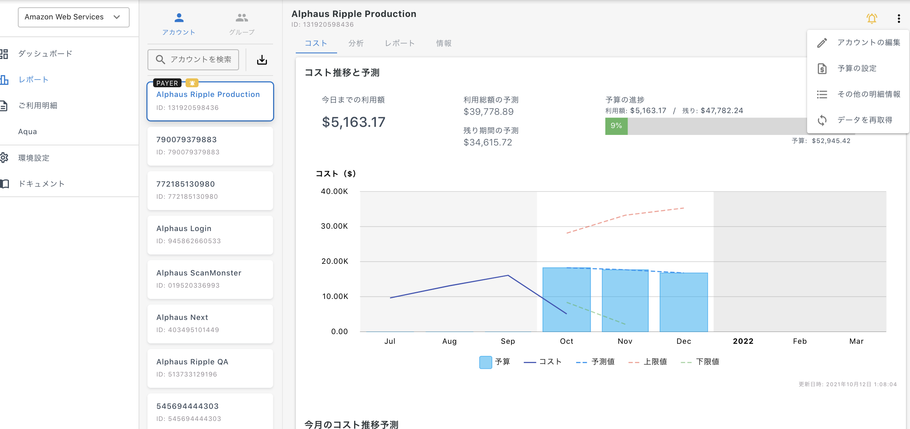
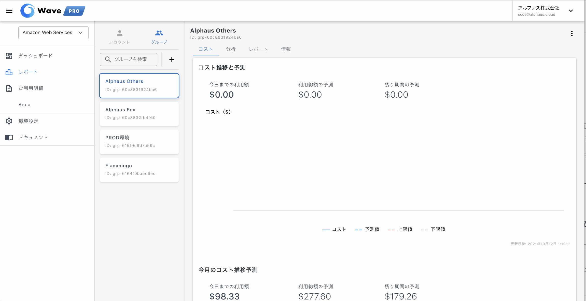

# レポート

レポートでは各アカウント、グループ、タグ単位での利用料を可視化するページです。

そのWave PROアカウントがAWSのアカウントの情報を含んでいるのか、タグ情報を含んでいるのか、双方を含んでいるのかにより表示が異なります。

## **アカウント: アカウント単位での利用料を表示**

右上のドロップダウンからは以下の設定が可能です。

* アカウントの編集: アカウント名の編集
* 予算の設定: 開始月を設定し、そこから3ヶ月の予算設定が可能。設定した予算は「コスト」タブのコスト推移と予測にて表示されます。
* その他明細情報の表示: 従量課金の利用料以外の項目が（前払金やクレジットなど）あった場合にのみデータが表示されます。
* データ再取得: 予算を再設定した場合などで最新データを再取得したい場合に実施します。

右上のベルマークからは通知設定が可能です。設定した値を超えた場合に設定した通知先に連絡されます。

* 通知先: メール、slack
* 日次: 固定（例: $50以上）、前日比
* 月次: 固定（例: $1000以上）

注意点
* 最新データはAWSのデータ更新の頻度とWave PROのデータ取得のタイミングに依存し、多くの場合前日のデータが最新データとなります。
* 毎日夜10時に前々日〜最新日の利用料を確認し予算を超過している場合には通知を行います。
* 1アカウントに対して1つの設定のみとなります。

## **グループ: アカウントをグルーピングしてWave PRO上でのグルーピングを作成**

グルーピングしたアカウントの合計利用料を表示します。

グループの作成方法

1. グループを検索の右横にある + ボタンをクリック
2. グループ名と含めるアカウントを選択の上「作成する」を押して完了

右上のドロップダウンからは以下の設定が可能です。

* グループの編集: グループ名と含めるアカウントの変更が可能。
* 予算の設定: 開始月を設定し、そこから3ヶ月の予算設定が可能。設定した予算は「コスト」タブのコスト推移と予測にて表示されます。
* グループの削除: 選択したグループの削除。この操作は元に戻せません。
* データ再取得: 予算を再設定した場合などで最新データを再取得したい場合に実施します。

## クロスタグ: AWSコスト配分タグごとの利用料を表示

\* 設定されているWave PROアカウントのみ利用可能です。

タグのKey/Valueごとリストが表示され、各タグの利用料が確認できます。

分析タブでは日時・月次のグラフが確認できます。
レポートタブでは詳細な利用状況をリスト形式で使用量と合わせて確認できます。

